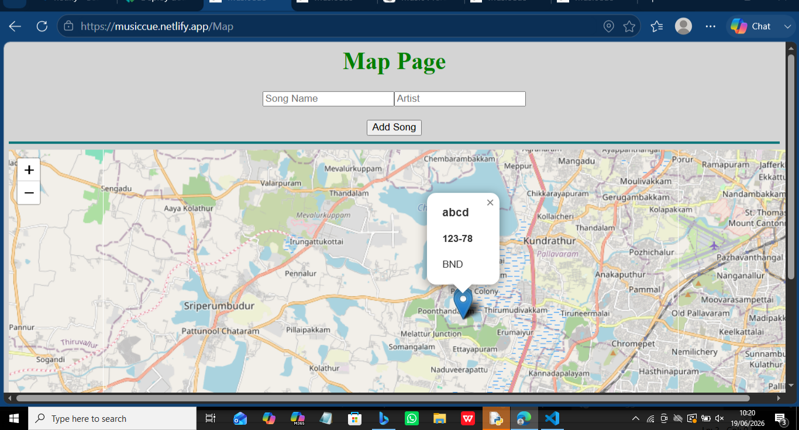
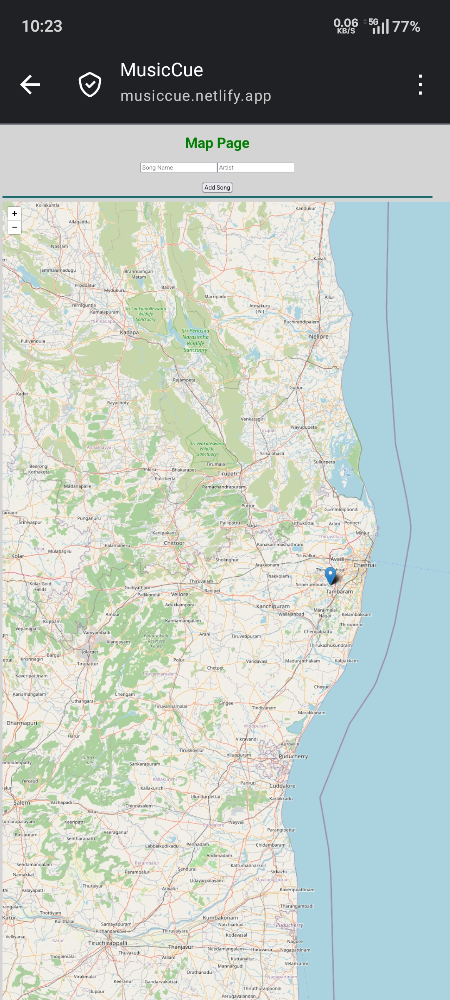

**MusicCue**
MusicCue is a full-stack web application that allows users to pin songs to real-world locations and discover music shared by others around them.Users can register, log in securely, and associate songs with geographic locations, creating an interactive map-based music discovery experience.

Live Demo
Frontend: https://musiccue.netlify.app
Backend API: https://musiccue.onrender.com

Features
* User registration and login
* Secure password hashing using bcrypt
* JWT-based authentication
* Add songs to specific geographic locations
* Interactive map interface
* View songs shared by other users
* Rate limiting for API protection
* PostgreSQL cloud database integration

Tech Stack
Frontend
* React
* React Router DOM
* Axios
* React Leaflet
* CSS

Backend
* Node.js
* Express.js
* JWT Authentication
* bcrypt
* express-rate-limit
* CORS

Database
* PostgreSQL
* NeonDB

Deployment

* Netlify (Frontend)
* Render (Backend)

Project Structure
MusicCue/

├── frontend/

└── backend/

Authentication Flow
1. User registers an account
2. Password is hashed using bcrypt
3. User logs in
4. Backend generates a JWT token
5. Token is stored in localStorage
6. Protected routes verify the token before allowing access

Core Idea
MusicCue combines music and geography by allowing users to leave songs at locations and discover songs added by others.

Screenshots
Desktop View

Mobile View

Developed By : Dharshini Sankar

Dharshini Sankar

